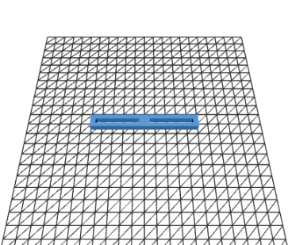

inputlag 2025
====

This repository contains engineering materials of the inputlag team's self-driven vehicle's model participating in the World Robotics Olympiad Future Engineers competition. The robot was designed and built by a team of three students.

## Content

* `t-photos` contains 2 photos of the team (an official one and one funny photo with all team members)
* `v-photos` contains 6 photos of the vehicle (from every side, from top and bottom)
* `video` contains the video.md file with the link to a video where driving demonstration exists
* `schemes` contains one or several schematic diagrams in form of JPEG, PNG or PDF of the electromechanical components illustrating all the elements (electronic components and motors) used in the vehicle and how they connect to each other.
* `src` contains code of control software for all components which were programmed to participate in the competition
* `models` is for the files for models used by 3D printers, laser cutting machines and CNC machines to produce the vehicle elements. If there is nothing to add to this location, the directory can be removed.
* `other` is for other files which can be used to understand how to prepare the vehicle for the competition. It may include documentation how to connect to a SBC/SBM and upload files there, datasets, hardware specifications, communication protocols descriptions etc. If there is nothing to add to this location, the directory can be removed.


## Meet The Team

### Ansel Kee Jun Xi

### Shahrel Chua Zong Yuan

### Loh Zheng Xiang


## The Challenge 

The **[WRO 2024 Future Engineers - Self-Driving Cars](https://wro-association.org/)** challenge invites teams to design, build, and program a vehicle capable of driving autonomously on a racetrack. The competition includes two main tasks: completing laps while navigating randomized obstacles and successfully performing a precise parallel parking maneuver. Teams must integrate advanced robotics concepts such as computer vision, sensor fusion, and kinematics, focusing on innovation and reliability.

This challenge emphasizes aspects of the engineering process, such as:
- **Mobility Management:** Developing efficient vehicle movement mechanisms and functions.
- **Obstacle Handling:** Strategizing to detect and navigate traffic signs (red and green markers) within specified rules.
- **Documentation:** Showcasing engineering progress, design decisions, and open-source collaboration through a public GitHub repository.

Points are awarded based on performance in the challenge rounds, quality of the engineering documentation, and the ability to create an innovative and robust solution.

Learn more about the challenge [here](https://wro-association.org/wp-content/uploads/WRO-2024-Future-Engineers-Self-Driving-Cars-General-Rules.pdf).


## Photos of our Robot
//Insert photos here

## Video of our Robot 
[Link] //Insert link here


# Mobility Management
The robot's mobility is managed by a combination of the chassis, powertrain and steering. These elements work together to ensure fast and efficient movement of the robot.


## Powertrain
We used 2 NEMA 17 Stepper Motors to act as our main driving force, and to control the speed of the steppers, we utilised a TB6600 Stepper Motor Driver


## Steering
After experimenting with various steering mechanisms, we decided to settle for a simple yet efficient system of front wheel steering. We chose to use a MG996R servo motor as our key component, favouring it for its wide range of mobility and fast response. The servo is connected pointing downwards to a system of two axles, allowing for a full 360 degrees of rotation.



## Chasis
To maximise speed, we decided to use an entirely 3D-printed chassis after discussion. This allowed our robot to become more lightweight and compact as compared to previous iterations.
The chassis makes use of a simple streamlined shape, consisting of an elevated platform on the back to house the arduino, and allow for more room for wiring. The front of the chassis has a hole to accomodate the MG996R servo and steering system. The battery pack and HuskyLens are also situated at the front of the chassis.


# Power and Input Management
The vehicle uses a battery pack consisting of 4 3.7V 18650 batteries. 
These batteries are used to power the stepper motors and stepper motor driver.
The rest of the components draw power from an Arduino Uno, which also serves as the main microcontroller for all of the robot's inputs and motors.
The robot draws information about its surroundings through a HuskyLens AI Machine Vision Sensor for visual input, and a MPU-6050, which serves as a gyroscope.


# Program Flow
Our program consists of 3 main functions:
1. Steering
2. Driving
3. Obstacle and Wall Detection


## Steering
We utilised the Servo.h library, which provides the necessary functions to manage the servo movements. We initialise a servo object and attached it to pin 9 on the Arduino. We then set the angle of the servo to the default starting position, which is facing forward.

```
// Setup steering servo
myservo.attach(9);
// reset to forward
myservo.write(100);
```

We then also define functions that turn the servo either left or right, by setting the value of the servo using servo.write().
This is to allow for easier readabilit and convenience, due to the frequency which we will be requiring the servo to turn in either direction.
```
void turn_left() {
  left = true;
  myservo.write(75);
  stepper.runSpeed();
}

void turn_right() {
  right = true;
  myservo.write(125);
  stepper.runSpeed();
}

void right_90() {
  myservo.write(150);
  stepper.runSpeed();
}

void left_90() {
  myservo.write(50);
  stepper.runSpeed();
}
```


## Driving
To control the stepper motors, we use the AccelStepper.h library. We create a stepper object by initialising it with the corresponding step and direction pins, as well as setting a fixed speed value.
```
#define dirPin 2
#define stepPin 3
AccelStepper stepper = AccelStepper(motorInterfaceType, stepPin, dirPin);
float speed = 4000;
```

Afterwards we just call the `stepper.runSpeed()` function every loop to ensure that the steppers can constantly turn the wheels and run the vehicle at a steady pace.


## Obstacle and Wall Detection
First, we set the speed of the stepper, and turn on the HuskyLens and switch to the color recognition algorithm.
```
void setup() {
  // Set the maximum speed and acceleration:
  // Serial.begin(115200);
  Wire.begin();
  stepper.setMaxSpeed(speed);
  stepper.setAcceleration(speed);
  stepper.setSpeed(speed);

  // Setup steering servo
  myservo.attach(9);
  // reset to forward
  myservo.write(100);
  t = millis();

  Serial.begin(9600);
  while (!huskylens.begin(Wire)) {
    Serial.println("Begin failed!");
    Serial.println("1.Please recheck the \"Protocol Type\" in HUSKYLENS (General Settings>>Protocol Type>> I2C)");
    Serial.println("2.Please recheck the connection.");
    delay(1000);
  }
  if (!huskylens.writeAlgorithm(ALGORITHM_COLOR_RECOGNITION)) {
    Serial.print("Failed to set algorithm");
  }
  huskylens.setTimeOutDuration(1);
}
```

We use the millis() function to act as a pseudo timer, as it records the time in milliseconds from which the program starts running, which will allow use to time several other functions.


In the main loop, we constantly request the HuskyLens for detected objects, and check for the amount of red and green blocks that it can see.

```
  stepper.runSpeed();
  if (recheck && millis() % 2000 == 0) {
    if (huskylens.requestBlocks()) {
      redCount = huskylens.count(redID);
      greenCount = huskylens.count(greenID);
      if (redCount > 1) {
        turn_right();
        recheck = false;
      } else if (greenCount > 1) {
        turn_left();
          recheck = false;
      } else if (redCount == 1 && greenCount == 1) {
        //get results and check which is closer
        HUSKYLENSResult redResult = huskylens.getBlock(redID, 0);
        HUSKYLENSResult greenResult = huskylens.getBlock(greenID, 0);
        int redArea = redResult.width * redResult.height;
        int greenArea = greenResult.width * greenResult.height;
        if (redResult.yCenter < greenResult.yCenter && redArea < greenArea) {
          turn_left();
          left90 = true;
          recheck = false;
        } else if (redResult.yCenter > greenResult.yCenter && redArea < greenArea) {
          turn_right();
          right90 = true;
          recheck = false;
        } else {
          recheck = true;
        }
      } else {
        recheck = true;
      }
    }
  }
```
In the case that the HuskyLens sees multiple traffic cones, it uses the width and height of the detected objects to calculate their corresponding areas to compare which cone is further. After determining the correct traffic cone to follow, it then calls the corresponding turn function to allow the robot to navigate past the cone successfully.

```
 if (millis() - t >= 5000 && !middle) {
    if (left) {
      myservo.write(125);
    } else if (right) {
      myservo.write(75);
    } else if (left90) {
      myservo.write(50);
    } else if (right90) {
      myservo.write(150);
    }
    middle = true;
  }
  if (millis() - t >= 10000) {
    if (left || right) {
      myservo.write(100);
    }
  }
  if (millis() - t >= 15000) {
    if (left90) {
      myservo.write(150);
    } else if (right90) {
      myservo.write(50);
    }
    turned = true;
  }
  if (millis() - t >= 20000 && turned) {
    if (left90) {
      myservo.write(125);
    } else if (right90) {
      myservo.write(75);
    }
  }
```

After it has successfully navigated around the obstacle, the robot then turns in the opposite direction to realign itself to face forwards again

```
  if (millis() - t >= 5000 && !middle) {
    if (left) {
      myservo.write(125);
    } else if (right) {
      myservo.write(75);
    } else if (left90) {
      myservo.write(50);
    } else if (right90) {
      myservo.write(150);
    }
    middle = true;
  }
  if (millis() - t >= 10000) {
    if (left || right) {
      myservo.write(100);
    }
  }
  if (millis() - t >= 15000) {
    if (left90) {
      myservo.write(150);
    } else if (right90) {
      myservo.write(50);
    }
    turned = true;
  }
  if (millis() - t >= 20000 && turned) {
    if (left90) {
      myservo.write(125);
    } else if (right90) {
      myservo.write(75);
    }
  }

  if (millis() - t >= 25000) {
    left = false;
    right = false;
    left90 = false;
    right90 = false;
    turned = false;
  }
```


